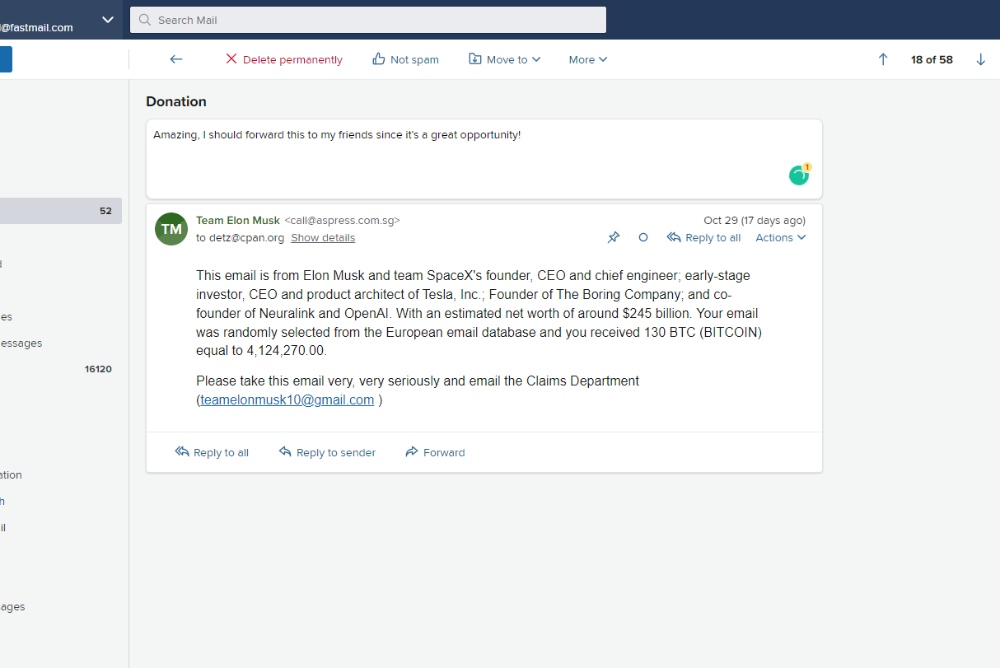

# FastNotes

A simple chrome extension that lets you add notes to fastmail.com messages.

When you open an email a little white box will appear above the message. Any notes you enter here will be saved in localstorage and show up next time you view this message.

To install go to your extensions, make sure you're in developer mode and then click "Load unpacked" button to load the folder.

